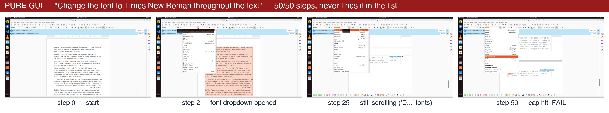
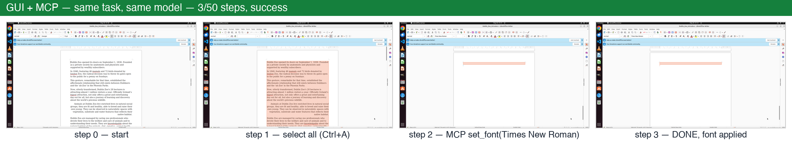
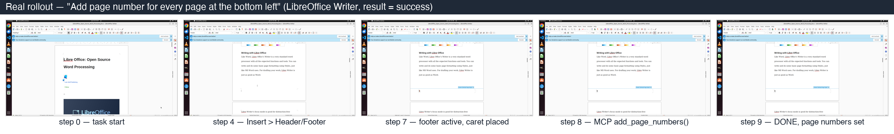
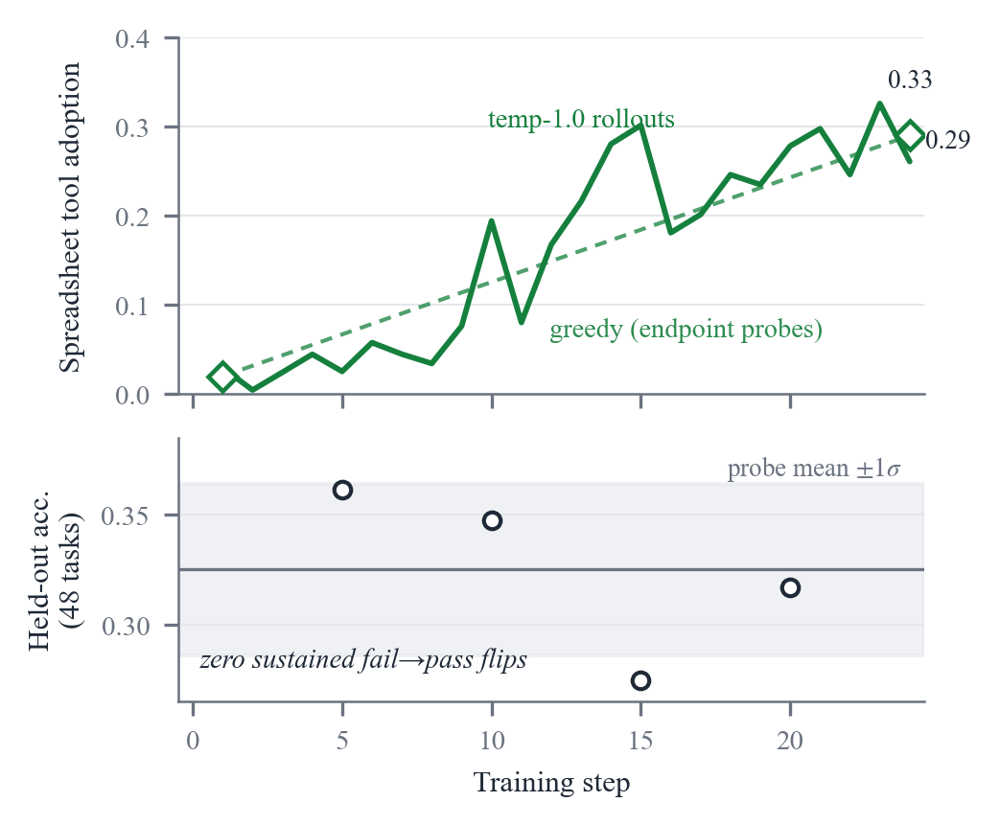
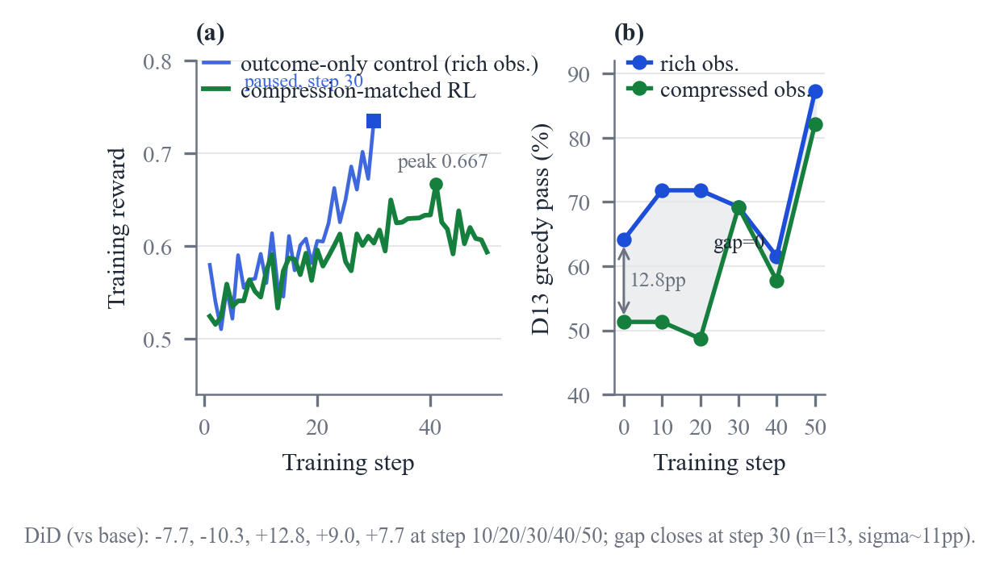
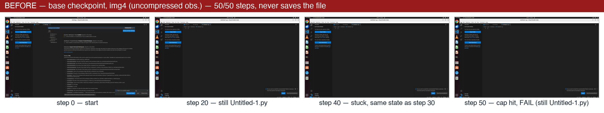
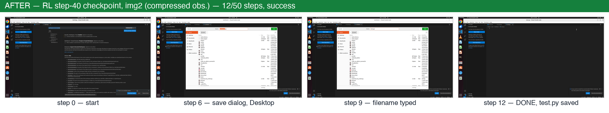
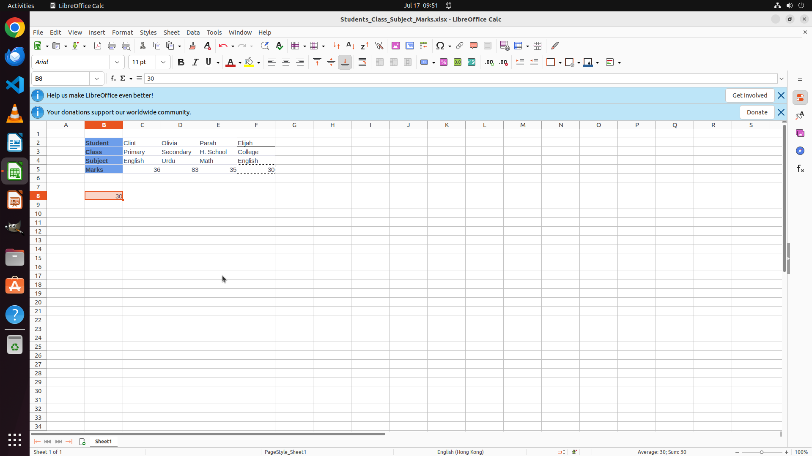
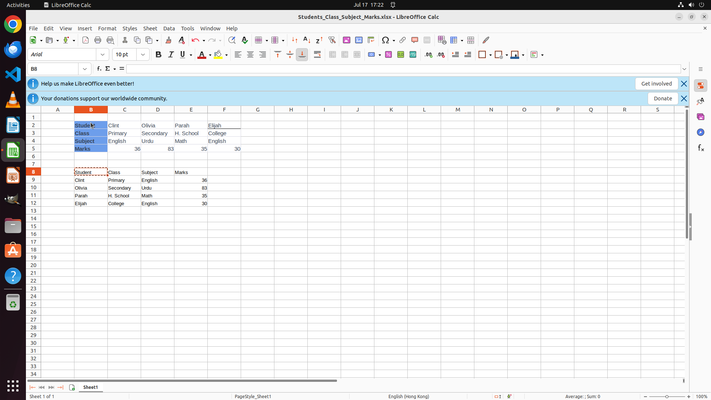

# Hybrid GUI + MCP Action-Space RL on OSWorld

**English** | [中文](README.zh-CN.md)

Reinforcement learning for a **hybrid action space** — low-level GUI control (pyautogui) *and* high-level MCP tool calls — on the [OSWorld](https://github.com/xlang-ai/OSWorld) computer-use environment, evaluated on the [OSWorld-MCP](https://github.com/X-PLUG/OSWorld-MCP) benchmark (309 tasks), using **Qwen3-VL-8B-Thinking** as the policy.

This is the code companion to our paper **[Screenshots or Tools? Eliciting Tool Use and Managing Multimodal Context in Hybrid GUI–MCP Computer-Use Agents](https://arxiv.org/abs/2608.03327)** (arXiv:2608.03327). It contains the full inference, evaluation, and RL-training pipeline, the experiment configs behind every table, and the task splits. Model weights, the VM image, and the MCP tool set are external — see [Setup](#setup).

> **Scope note.** Two levels of results. **(1) Action level (behavior is steerable, competence is not):** a dense tool bonus raises spreadsheet tool-adoption **0.03 → 0.33** and this carries into greedy decoding, but held-out accuracy does **not** follow. The bottleneck is **tool-call semantics**, not adoption. **(2) Context level (a concrete efficiency win):** a successful tool call often makes the next screenshot redundant. Dropping it and halving image history cuts input tokens by about a third at a small accuracy cost; **retraining under the same observation rule removes that cost**. The compressed agent reaches **37.8% vs 33.0%** for the uncompressed operating point, at **53% of the input cost**, and closes the rich–lean gap on a pre-registered degraded subset to **zero** (in-distribution).
>
> Takeaway: at the action level, tools are available but rarely called, and calls often fail semantically. At the context level, the tool result is already in context as text, so the following screenshot is redundant, yet it is kept by default. Both trace back to the same cause: training provides no signal for either. Full per-checkpoint numbers, configs, and provenance for every figure above are in [`results/context_rl/PROVENANCE.md`](results/context_rl/PROVENANCE.md) and [`results/dense_bonus/`](results/dense_bonus/README.md); see also [`REPRODUCE.md`](REPRODUCE.md).

## At a glance

**Same task, same model — the only difference is whether MCP tools are exposed.** Pure GUI burns all 50 steps scrolling a font list; the hybrid agent selects all, makes one tool call, and finishes in 3 steps:




A complete successful hybrid rollout (*"add page number for every page at the bottom left"*, LibreOffice Writer) — GUI steps to reach the footer, then one MCP call finishes the job:



---

## Where to start

- **Check a paper number** → [`REPRODUCE.md`](REPRODUCE.md) maps every claim to a command and its result artifact.
- **Run something** → [Quickstart](#quickstart) below; every RL experiment is one YAML under `configs/experiments/`.
- **Confused by the split files** → the TL;DR table in [`data/README.md`](data/README.md); at runtime only three sets matter (train 74 / held-out 48 / eval 309).
- **Building on this repo, with or without an AI coding agent** → [`AGENTS.md`](AGENTS.md) is the repo map for coding agents: architecture, invariants, footguns, and the cheap-feedback-loop ladder. Recommended workflow: treat `REPRODUCE.md` as the spec, express changes as a new YAML under `configs/experiments/` (never edit the base config in place), and validate with compileall → smoke test → probe before any full run.

## What's here

```
osworld_rl.py            # top-level RL orchestrator (serve→rollout→reward→preproc→train)
train/                   # accelerate + DeepSpeed training worker (osworld_train.py, preproc)
reward/                  # reward / advantage computation (outcome, dense MCP bonus, pos-adv-only)
agents/                  # BM25 tool retriever
prompts/                 # policy / reward prompt templates
tools/                   # tools_registry.json (MCP tool corpus the retriever ranks)
mcp_tools/               # vendored MCP server + tools (injected into the VM; the paper tool set)
configs/
  osworld_rl.yaml        # base config (paths via ${oc.env:...})
  experiments/           # one YAML per paper run (RL run series + probes/profiles)
  env.example.sh         # machine-specific env vars (copy to env.sh, source it)
data/splits/             # task-id splits + metadata
scripts/                 # run_mcp_eval.sh, run_puregui_eval.sh, prepare_splits_v2.py, ...
OSWorld-main/            # vendored, modified OSWorld (see OSWorld-main/PATCHES.md)
docs/                    # ENVIRONMENT.md + research notes
results/outcome_only/, results/context_rl/  # paper numbers, per-checkpoint cells, provenance, recompute
```

## Setup

Our setup (the source of every number in the paper): **8× 80 GB-class GPUs**, Docker with **/dev/kvm**, a fast local disk for scratch, Python 3.10. The scripts assume this layout (8 vLLM instances + 96 parallel VMs); Qwen3-VL-8B fits on a single GPU, so fewer cards also work — lower the instance count and `NUM_ENVS` accordingly, at reduced parallelism.

```bash
# 1. environment
conda env create -f setup/environment_rlanything.yml   # or: pip install -r requirements.txt
pip install -r OSWorld-main/requirements.txt

# 2. machine-specific paths / secrets (nothing is hardcoded)
cp configs/env.example.sh env.sh && $EDITOR env.sh && source env.sh
cp OSWorld-main/.env.example OSWorld-main/.env         # local vLLM: key can stay "dummy"

# 3. external assets (not in this repo) — see docs/ENVIRONMENT.md
#    - model:  Qwen/Qwen3-VL-8B-Thinking  -> $MODEL_DIR/
#    - VM:     happysixd/osworld-docker + patched Ubuntu-MCP.qcow2 -> /dev/shm/
#    - MCP:    ships in-repo (mcp_tools/); set MCP_SRC_ROOT=0 for stock OSWorld-MCP
```

See [`docs/ENVIRONMENT.md`](docs/ENVIRONMENT.md) for the Docker+QEMU provider, the MCP-in-VM architecture, the patched VM image, and hardware notes.

## Released checkpoints

Two RL policy checkpoints are released on the HuggingFace Hub. Each is a complete, directly-loadable Qwen3-VL-8B model directory (config + `model.safetensors` + tokenizer/processor).

| Checkpoint | Run | What it is | HF repo |
|-----------|-----|-----------|---------|
| **outcome-only** | `outcome_only_rl` | pure outcome-only RLVR — tool adoption 0.02→0.33 but held-out flat ([results/outcome_only](results/outcome_only/README.md)) | [`redai-infra/hybrid-routing-outcome-only`](https://huggingface.co/redai-infra/hybrid-routing-outcome-only) |
| **context-RL** | `context_rl` | train=eval context-compression RL — **epoch-40** paper operating point, 37.8% @ 51% input cost, img2 + `skip_on_mcp_success` ([results/context_rl](results/context_rl/PROVENANCE.md)) | [`redai-infra/hybrid-routing-context-rl`](https://huggingface.co/redai-infra/hybrid-routing-context-rl) |

```bash
# download
huggingface-cli download redai-infra/hybrid-routing-context-rl --local-dir ckpts/context_rl

# evaluate a checkpoint (point MODEL at the downloaded dir)
MODEL=ckpts/context_rl bash scripts/run_mcp_eval.sh
```

## Quickstart

**Smoke test (a few tasks, end-to-end):**
```bash
TEST_META=evaluation_examples/smoke_test.json bash scripts/run_mcp_eval.sh
```

**Reproduce the two inference baselines on the 309-task set:**
```bash
# B1 — pure GUI (pyautogui, no MCP)   -> overall 30.5% (5-run mean)
bash scripts/run_puregui_eval.sh
python OSWorld-main/show_result.py --result_dir baselines/b1_puregui_thinking

# B2 — GUI + MCP (tool retrieval + MCP calls)   -> overall 34.5% (5-run mean; best single run 37.9%)
bash scripts/run_mcp_eval.sh
python OSWorld-main/show_result.py --result_dir baselines/b2_mcp_thinking
```
Add `MODEL_TYPE=instruct` to either for the Instruct model (B1/B2-Instruct).

**Inference context-policy sweep** (baseline / `skip_on_mcp_success` / `skip_on_no_change`, img4 / img2) runs via env vars on the same script, e.g. `CONTEXT_POLICY=skip_on_mcp_success MAX_IMAGE_HISTORY_LENGTH=2 bash scripts/run_mcp_eval.sh` — see [`REPRODUCE.md`](REPRODUCE.md) §A.

**Run an RL experiment (Context-Compression RL):**
```bash
OSWORLD_LOCAL_TEMP="$OSWORLD_LOCAL_TEMP" TQDM_DISABLE=1 \
  nohup python osworld_rl.py config=configs/experiments/context_rl.yaml \
  > logs/context_rl.log 2>&1 &
```
Each experiment YAML has a self-contained header describing its hypothesis, read-out criteria, and kill-switch red lines.

## Headline results (309 tasks, temp=0, max_steps=50; 5-run means)

| Model | GUI only | GUI + MCP (win.4) | Δ(MCP) |
|-------|---------:|------------------:|-------:|
| **Thinking** | 30.5% | **34.5%** | **+4.0pp** |
| **Instruct** | 25.4% | 19.5% | **−5.9pp** |

The same MCP injection helps the **Thinking** model (+4.0pp) and hurts the **Instruct** model (−5.9pp), both beyond 2 SE — the paper characterizes *when* MCP injection helps. All headline numbers are 5-run means ([`baselines/COMPARISON.md`](baselines/COMPARISON.md), [`baselines/REPEATS.md`](baselines/REPEATS.md)); the best single Thinking run reaches 37.9%. Full tables, the adoption–competence result, and the context-compression DiD are in [`REPRODUCE.md`](REPRODUCE.md).

### The two RL probes, one figure each

**Action level — the dense tool bonus moves adoption, not competence** (paper Figure 2; training record in [`results/dense_bonus/`](results/dense_bonus/README.md)). Spreadsheet tool adoption rises 0.03→0.33 and carries into greedy decoding (0.02→0.29), while held-out accuracy stays at the base level with zero sustained fail→pass flips:



**Context level — matched training recovers the compression cost** (paper Figure 4; curves in [`results/context_rl/train-reward.csv`](results/context_rl/train-reward.csv) and [`results/outcome_only/train-reward.csv`](results/outcome_only/train-reward.csv), cells in [`results/context_rl/cells.json`](results/context_rl/cells.json)). (a) Training reward of the compressed run vs. the rich-observation control; (b) the D13 rich–lean gap collapsing to zero at step 30:



## Case studies

**RL before/after** — the same VS Code file-save task, run by the base checkpoint (uncompressed img4) and by the step-40 context-RL checkpoint (compressed img2). The base model loops for all 50 steps and never saves; the RL'd model walks the save dialog and finishes in 12 steps:




One running example — LibreOffice Calc matrix transposition (*"transpose B2:F5, paste at B8"*) — shows all three findings. Full walk-through in [`docs/CASES.md`](docs/CASES.md).

**Base fails with pure GUI** — 9 `pyautogui` steps fumbling *Paste Special*; only a stray `30` lands in B8:



**Context-RL succeeds via one MCP call** — the full transposed table appears at B8:



```json
{ "action_type": "mcp", "tool_name": "libreoffice_calc.transpose_range",
  "params": { "source_range": "B2:F5", "target_cell": "B8" } }
```

- **Capability flip** — base 0/3 → context-RL 3/3 (one of 15 such flips).
- **Tool adoption** — base uses `gui` only; the RL'd model *chooses* the MCP tool.
- **Context compression** — on a task both settings solve, img2 carries 2 screenshots/step vs img4's 4 → **61% of the input** (−39%) at the same result; the post-tool screenshot is skipped (`skip_on_mcp_success`).

## Citation

If you find this code or our paper useful in your research, please consider citing:

```bibtex
@article{fan2026screenshots,
  title   = {Screenshots or Tools? Eliciting Tool Use and Managing Multimodal
             Context in Hybrid GUI-MCP Computer-Use Agents},
  author  = {Fan, Siqi and Li, Minghao and Ma, Xiaoqian and Tan, Wenhui and
             Huang, Xiusheng and Wu, Juntong and Zhang, Liujie and Shang, Shuo
             and Chen, Weihang},
  journal = {arXiv preprint arXiv:2608.03327},
  year    = {2026},
  url     = {https://arxiv.org/abs/2608.03327}
}
```

## License & attribution

Apache-2.0 (see [`LICENSE`](LICENSE) and [`NOTICE`](NOTICE)). Built on [verl](https://github.com/volcengine/verl) (scaffolding), [OSWorld](https://github.com/xlang-ai/OSWorld), and [Qwen3-VL](https://github.com/QwenLM/Qwen3-VL).

## Acknowledgements

This project would not exist without the following open efforts — our sincere thanks to all of them:

- [**OSWorld**](https://github.com/xlang-ai/OSWorld) — the execution-based desktop benchmark and VM environment everything here runs on.
- [**OSWorld-MCP**](https://github.com/X-PLUG/OSWorld-MCP) — the verified MCP tool benchmark; our vendored tool set derives from it.
- [**ToolCUA**](https://github.com/X-PLUG/ToolCUA) — the closest concurrent work on GUI–tool path orchestration; its observations on MCP injection shaped our study design.
- [**RLAnything**](https://github.com/Gen-Verse/Open-AgentRL) — open-source RL for LLMs and agentic scenarios.
- [**Relax**](https://github.com/redai-infra/Relax) — high-performance distributed RL framework for multimodal LLM post-training.
