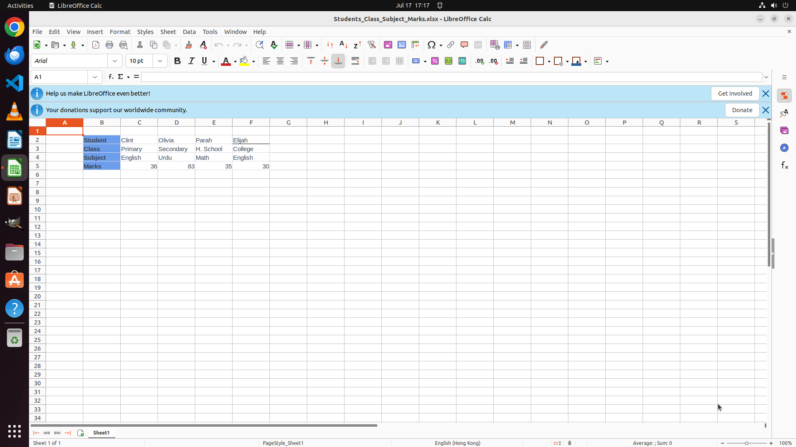

# Case studies

One running example — a LibreOffice Calc matrix transposition — illustrates all three findings. (OSWorld task `eb03d19a`, from `test_all_no_internet`.)

> **Task:** *"Apply matrix transposition to the table in B2:F5 and paste the transposed table at B8 (i.e., the top-left cell of the transposed table should be at B8)."*

Initial state — the 4×5 table sits in B2:F5, B8 is empty:



---

## Case 1 — capability flip (base fails → context-RL succeeds)

**Base (Qwen3-VL-8B, uncompressed img4)** — 9 steps of pure `pyautogui`: select, right-click, hunt through the *Paste Special* menus. The transpose paste goes wrong and only a single value `30` lands in B8. Task **failed** (0/3 reps):


**Context-RL checkpoint (epoch-40, compressed img2)** — after a few GUI steps it reaches for the right tool at step 10 and the full transposed table appears at B8:E12. Task **succeeded** (3/3 reps):


This is one of 15 tasks that flip from base-fail (0/3) to context-RL-success (≥2/3) on the 309-task set.

## Case 2 — tool adoption (GUI → MCP)

Same task, action types per step:

| model | action_types | outcome |
|---|---|---|
| base (img4) | `gui × 9` (all pyautogui) | fail |
| Context-RL (img2) | `gui × 10`, **`mcp`**, `gui` | success |

The decisive step is a single MCP tool call — legible and exactly on-task:

```json
{ "action_type": "mcp",
  "tool_name": "libreoffice_calc.transpose_range",
  "params": { "source_range": "B2:F5", "target_cell": "B8" } }
```

Behavior is steerable: RL taught the model to *choose* the tool where the base model only clicked. (Spreadsheet MCP adoption rises 0.02 → 0.33 across calc; see [`../results/outcome_only/README.md`](../results/outcome_only/README.md).) The caveat from the paper still holds — adoption rises far more broadly than competence; this is a task where choosing + integrating the tool actually paid off.

## Case 3 — context compression (img4 → img2), same task, both succeed

To isolate *cost* from *correctness*, take a task where the **same epoch-40 checkpoint succeeds under both observation rules**: calc task `2bd59342` (*"make sparkline charts for each order id with the data from Jan to Mar"*).

| observation | steps | screenshots carried / step | total input | outcome |
|---|---|---|---|---|
| **img4** (rich, no skip) | 50 | grows 1→2→3→**4**, then stays at 4 | 550k | ✅ |
| **img2** (lean + skip) | 50 | capped at **2**, drops to 1→0 late | **337k  (61%, −39%)** | ✅ |

Same task, same 50 steps, same success — the lean rule simply carries half the screenshots, so it costs 61% of the input. The trailing `… 2, 2, 1, 0, 0` in img2's per-step image count is `skip_on_mcp_success` dropping the redundant screenshot right after a successful tool call.

> On the transpose task in Cases 1–2 the lean model actually *out-solved* the rich one (img4 kept clicking GUI and failed 0/3, img2 called the tool and won 3/3) — striking, but it mixes correctness with cost. The sparkline task above isolates the pure efficiency effect: identical outcome, 39% cheaper input.

Aggregated over the 309-task set this is the paper's headline: **37.8% vs 33.0% at ~53% of the input cost** (see [`../results/context_rl/PROVENANCE.md`](../results/context_rl/PROVENANCE.md)).
